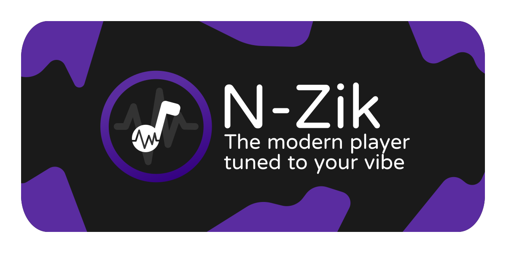

<div align="center">
  

  <h3>📱 <a href="https://github.com/N-Zik-Group/N-Zik">N-Zik App</a></h3>
  <p>
    <b>N-Zik Website</b> is the official website for <a href="https://github.com/N-Zik-Group/N-Zik">N-Zik</a>,
    the multilingual YouTube Music streaming app, hosted at
    <a href="https://n-zik.vercel.app/">n-zik.vercel.app</a>.
  </p>
  <p>
    A desktop companion is available: <a href="https://github.com/N-Zik-Group/N-Zik-Desktop-Compagnon">N-Zik Desktop Compagnon</a>
    for Windows and Linux - pair it with your phone over local Wi-Fi (QR code or manual code),
    then browse your library, manage the queue and listen on a large screen while your phone
    streams the audio through an embedded VLC, no VLC install needed. The phone stays the
    single source of truth, and the companion is a transitional product on the way to the
    standalone N-Zik desktop app.
  </p>
  <p>
    <strong>Note:</strong> This project is based on the website from
    <a href="https://github.com/fast4x/RiMusic">RiMusic</a>.
  </p>
  <p>
    <strong>N-Zik</strong> is a side project I originally built for myself and friends, not chasing glory.
    It's grown a bit since then, which is cool.
  </p>
  <p>
    I use generative AI to assist with code, structured with the
    <a href="https://github.com/bmad-code-org/BMAD-METHOD">BMAD Method</a>,
    but everything gets reviewed and tested before it's pushed. I'm not shipping blind.
  </p>
  <p>
    If AI-assisted development isn't your thing, no hard feelings,
    there are plenty of great alternatives.
  </p>
</div>

  <br><br>

  [](https://crowdin.com/project/N-Zik) [](https://www.gnu.org/licenses/gpl-3.0)
  [](https://www.codefactor.io/repository/github/n-zik-group/n-zik-website)

</div>

# 📲 Installation

[](https://github.com/N-Zik-Group/N-Zik/releases/latest)
[](https://github.com/N-Zik-Group/N-Zik/releases?q=&type=prerelease)
[](https://f-droid.org/packages/com.nevar.nzik.foss/)
[](https://apt.izzysoft.de/fdroid/index/apk/com.nevar.nzik.foss?repo=main)
[](https://www.openapk.net/n-zik/com.nevar.nzik.foss/)
[](https://www.androidfreeware.net/download-n-zik-apk.html)
[](<https://apps.obtainium.imranr.dev/redirect?r=obtainium://app/%7B%22id%22%3A%22com.nevar.nzik.foss%22%2C%22url%22%3A%22https%3A%2F%2Fgithub.com%2FN-Zik-Group%2FN-Zik%22%2C%22author%22%3A%22N-Zik-Group%22%2C%22name%22%3A%22N-Zik%20(FOSS)%22%2C%22preferredApkIndex%22%3A0%2C%22additionalSettings%22%3A%22%7B%5C%22includePrereleases%5C%22%3Afalse%2C%5C%22fallbackToOlderReleases%5C%22%3Atrue%2C%5C%22filterReleaseTitlesByRegEx%5C%22%3A%5C%22%5C%22%2C%5C%22filterReleaseNotesByRegEx%5C%22%3A%5C%22%5C%22%2C%5C%22verifyLatestTag%5C%22%3Afalse%2C%5C%22sortMethodChoice%5C%22%3A%5C%22date%5C%22%2C%5C%22useLatestAssetDateAsReleaseDate%5C%22%3Afalse%2C%5C%22releaseTitleAsVersion%5C%22%3Afalse%2C%5C%22trackOnly%5C%22%3Afalse%2C%5C%22versionExtractionRegEx%5C%22%3A%5C%22%5C%22%2C%5C%22matchGroupToUse%5C%22%3A%5C%22%5C%22%2C%5C%22versionDetection%5C%22%3Atrue%2C%5C%22releaseDateAsVersion%5C%22%3Afalse%2C%5C%22useVersionCodeAsOSVersion%5C%22%3Afalse%2C%5C%22apkFilterRegEx%5C%22%3A%5C%22N-Zik-foss%5C%5C%5C%5C.apk%5C%22%2C%5C%22invertAPKFilter%5C%22%3Afalse%2C%5C%22autoApkFilterByArch%5C%22%3Atrue%2C%5C%22appName%5C%22%3A%5C%22N-Zik%20(FOSS)%5C%22%2C%5C%22appAuthor%5C%22%3A%5C%22N-Zik-Group%5C%22%2C%5C%22shizukuPretendToBeGooglePlay%5C%22%3Afalse%2C%5C%22allowInsecure%5C%22%3Afalse%2C%5C%22exemptFromBackgroundUpdates%5C%22%3Afalse%2C%5C%22skipUpdateNotifications%5C%22%3Afalse%2C%5C%22about%5C%22%3A%5C%22N-Zik%20is%20a%20multilingual%20YouTube%20Music%20client%20built%20with%20performance%20improvements%2C%20UI%2FUX%20refinement%2C%20and%20new%20features.%5C%22%2C%5C%22refreshBeforeDownload%5C%22%3Afalse%2C%5C%22includeZips%5C%22%3Afalse%2C%5C%22zippedApkFilterRegEx%5C%22%3A%5C%22%5C%22%2C%5C%22includeTarballs%5C%22%3Afalse%2C%5C%22tarballedApkFilterRegEx%5C%22%3A%5C%22%5C%22%7D%22%2C%22overrideSource%22%3Anull%7D>)
[](https://appteka.store/search?q=N-Zik)

<div align="center">

## 📚 Wiki

[](https://deepwiki.com/N-Zik-Group/N-Zik-Website)

<br>

## 🌍 Community

Join the N-Zik Discord:

<a href="https://discord.gg/bneHC7QRje">
  
</a>

<br>

</div>

# 🎧 Features

- 🌍 **Multilingual Support**: 46 languages - 45 translated locales in `res/` + English default, 35 are selectable in the footer language selector.
- 📥 **Download Hub**: Store badges for GitHub, F-Droid, IzzyOnDroid, OpenAPK, AndroidFreeware, Obtainium and Appteka.
- 🖥️ **N-Zik Desktop Compagnon** (Windows & Linux): Pair it with your phone over local Wi-Fi (QR code or manual code), then browse your library, manage the queue and listen on a large screen while your phone streams the audio through an embedded VLC, no VLC install needed. The phone stays the single source of truth.
- 🎬 **Feature Showcase**: 10 demo videos - home, lyrics, audio visualizer, rewind, songs, search, OTA updates, carrousel, artist pages and settings.
- 🎨 **Theme Presets**: Previews of the 6 visual themes the app ships with.
- ⚡ **Zero Build**: Vanilla HTML/CSS/JavaScript - no framework, no build step, no dependencies.
- 📱 **Fully Responsive**: From phone to widescreen.
- 🔎 **SEO Ready**: `robots.txt`, `sitemap.xml` and semantic single-page markup.

# 🌐 Supported Languages

Thanks to all our amazing contributors!
Here are the languages currently supported:

- 🇿🇦 **Afrikaans**
- 🇸🇦 **Arabic**
- 🇦🇿 **Azerbaijani**
- 🇪🇸 **Basque**
- 🇷🇺 **Bashkir**
- 🇧🇩 **Bangla**
- 🇪🇸 **Catalan**
- 🇨🇳 **Chinese (Simplified)**
- 🇹🇼 **Chinese (Traditional)**
- 🇨🇿 **Czech**
- 🇩🇰 **Danish**
- 🇳🇱 **Dutch**
- 🇬🇧 **English**
- 🌍 **Esperanto**
- 🇪🇪 **Estonian**
- 🇵🇭 **Filipino**
- 🇫🇮 **Finnish**
- 🇫🇷 **French**
- 🇪🇸 **Galician**
- 🇩🇪 **German**
- 🇮🇱 **Hebrew**
- 🇮🇳 **Hindi**
- 🇭🇺 **Hungarian**
- 🇮🇩 **Indonesian**
- 🌐 **Interlingua**
- 🇮🇪 **Irish**
- 🇮🇹 **Italian**
- 🇯🇵 **Japanese**
- 🇰🇷 **Korean**
- 🇮🇳 **Malayalam**
- 🇳🇴 **Norwegian**
- 🇮🇳 **Odia**
- 🇵🇱 **Polish**
- 🇧🇷 **Portuguese (Brazil)**
- 🇵🇹 **Portuguese (Portugal)**
- 🇷🇴 **Romanian**
- 🇷🇺 **Russian**
- 🇷🇸 **Serbian (Cyrillic)**
- 🇷🇸 **Serbian (Latin)**
- 🇱🇰 **Sinhala**
- 🇪🇸 **Spanish**
- 🇸🇪 **Swedish**
- 🇮🇳 **Tamil**
- 🇮🇳 **Telugu**
- 🇹🇷 **Turkish**
- 🇺🇦 **Ukrainian**

## 🌍 Help Translate

Want to:

- Translate into a new language?
- Improve an existing translation?
- Fix typos or inconsistencies?

Join us on Crowdin!

> ❓ Don't see your language?

[](https://crowdin.com/project/N-Zik)

---

# 🤝 Contributing

## 🛠️ Improve the Website

Pull requests are welcome!
Feel free to fix bugs, enhance features, or suggest new ideas.

# 📜 Clone the repo

Use this command to clone the repo

```
git clone -b main --single-branch https://github.com/N-Zik-Group/N-Zik-Website.git
```

Don't forget: to add a translation, create `res/values-xx/strings.xml` **and** add the language to the
footer language selector in `index.html` (the selector currently lags behind `res/` -
11 translated locales are present in `res/` but not yet selectable in the UI).

# 🫂 Acknowledgements

### 🛠 Based on / Inspired by:

- [**RiMusic**](https://github.com/fast4x/RiMusic): The website this project is based on.
- [**ViMusic**](https://github.com/vfsfitvnm/ViMusic)

### 🎨 Design & UI Contributions:

- Current banner and logo [**OrangeZXZ**](https://github.com/OrangeZXZ), [**NEVARLeVrai**](https://github.com/NEVARLeVrai)

### 🌍 Platform & Ecosystem:

- [**Crowdin**](https://crowdin.com/): Community translation platform powering 46 languages.
- [**Vercel**](https://vercel.com/): Hosting.

# ⚠️ Disclaimer

This project has no relation to the original author of [RiMusic](https://github.com/fast4x/RiMusic).

Furthermore, its contents are not affiliated with, funded, authorized, endorsed by, or in any way associated with YouTube, Google LLC, or any of its affiliates or subsidiaries.

Any trademarks, service marks, trade names, or other intellectual property rights used in this project remain the property of their respective owners.

Made with ❤️ by [NEVARLeVrai](https://github.com/NEVARLeVrai)
Licensed under GPLv3 - see [LICENSE](LICENSE)
